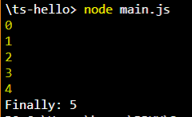

#JOBSHEET 2


###Praktikum -   1: Instalasi Typescript
---

* Cara mengistal typescript dengan perintah berikut ` npm install -g typescript `.
* Kemudian cek versinya menggunakan ` tsc --version `.

* Membuat folder **ts-hello** menggunakan ` mkdir ts-hello `.
* Isi **main.ts** dengan code berikut:

```typescript
function log(message) {
    console.log(message);
}

let message = 'Hello World';
log(message);
```

* Kemudian ketik perintah ` tsc main.ts ` untuk melakukan proses transpile file typescript kedalam javascript.


* Meng-execute file main js menggunakan ` node main.js `.


###Praktikum –   2: Declaring Variables
---

* Edit code file **main.ts**, menjadi seperti berikut:

```typescript
function doSomething() {
    for (let i = 0; i < 5; i++) {
        console.log(i);
    }
    console.log('Finally: ' + i);
}
doSomething();
```

* Kemudian hapus file **main.js** menggunakan ` del main.js ` (Command Prompt).
* Kemudian transpile file **main.ts**  menggunakan ` tsc main.ts `.
* Jalankan file **main.js** menggunakan ` node main.js `.


Praktikum –   3: Declaring Variables
---

* Buka file **main.ts** kemudian tulis code berikut:

```typescript
let count = 5;
count = 'a';
```

* Transplie **main.ts** menggunakan ` tsc main.ts `.
* Hasil dari pembenaran di file **main.js**

```javascript
var count = 5;
count = 'a';
```

###Praktikum -   4: Type Assertion
---

* Buka file **main.ts** kemudian tulis code berikut:

```typescript
let pesan;
pesan = 'abc';
let percobaan = (<string>pesan).endsWith('c');
let alternative = (pesan as string).endsWith('c');
```

###Praktikum -   5: Arrow Function
---

* Buka file **main.ts** kemudian tulis code berikut:

```typescript
let log = function pesan() {
    console.log(pesan);
}

let doLog = (pesan) => {
    console.log(pesan);
}

let doLog1 = (pesan) => console.log(pesan);
```

###Praktikum -   6: Interface
---

* Buka file **main.ts** kemudian tulis code berikut:

```typescript
interface Point {
    x:number;
    y:number;
}

let drawPoint = (point:Point) => {

}

drawPoint ({
    x:1;
    y:3;
})
```

Praktikum -   7: Classes
---

* Buka file **main.ts** kemudian tulis code berikut:

```typescript
class Pointku {
    a:number;
    b:number;

draw() {

}

getDistance(another:Pointku) {

    }
}
```

Praktikum -   8: Objects
---

* Buka file **main.ts** kemudian tulis code berikut:

```typescript
class Pointku1 {
    a:number;
    b:number;

    draw() {
        console.log('X' + this.a + ',Y' + this.b);
    }

    getDistance(another:Pointku1) {

    }
}

let coins:Pointku1
coins.draw();
```