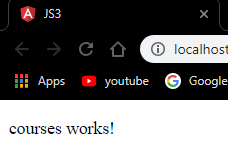
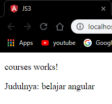
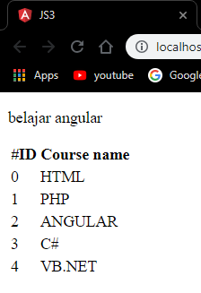
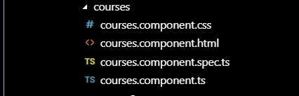
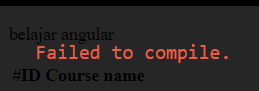
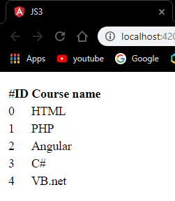

#JOBSHEET 3


###Praktikum - 1: Component Basic


* Membuat komponen dengan nama **courses** dengan cara ` ng g c courses `.


* Kemudian ke directory **src/app** kemudian buka file **app.component.html**.
* Edit isi file tersebut menjadi seperti berikut:

```html
<app-courses></app-courses>

<router-outlet></router-outlet>
```

* Kemudian jalankan menggunakan ` ng serve --open `



* Buka file app.module.ts dan hapus `coursecomponent` pada declarations.


* terjadi error karena coursecomponent tidak dapat di temukan

### Praktikum 2 : Templates

* Buka file `courses.component.ts` tambahkan property baru dengan nama title.


* Tambahkan string pada binding datanya. Buka file `courses.component.html` tambahkan :
```html
<p>
    courses work!
</p>
<p>
    {{"judulnya:" + title}}
</p>
```



* Buka file `courses.component.ts` dan buatlah sebuah method dengan nama getTitle :
```html
getTitle(){
    return this.title;
}
```
* Kemudian buka file `component.courses.html` lakukan modifikasi penambahan method `getTitle()` :


### Praktikum 3

* Buka file `courses.components.ts` dan buat property denagn nama course dengan data berrupa array.
```html
Courses = [
    {id : 0, name: 'HTML'},
    {id : 1, name: 'PHP'},
    {id : 2, name: 'Angular'},
    {id : 3, name: 'C#'},
    {id : 4, name: 'VB'},
]
```
* Buka file `courses.component.html` lalu tambahkan directive `ngFor` dan ` string interpolation` seperti berikut :

```html
<table>
    <thead>
        <th>
            #ID
        </th>
    </thead>
    <tbody>
        <tr *ngFor="let Courses of Courses">
        <!-- String interpolation -->
        <td>{{ Course.id }}</td>
        <td>{{ Course.name }}</td>
    </tbody>
</table>
```



### Praktikum 4

* Buatlah service baru yang bernama  **courses** dengan perintah `ng g s **courses**`.



* Buka file `courses.service.ts` kemudian tambahkan method `getCourse` seperti :

```html
getCourses(){
    return [
    {id : 0, name: 'HTML'},
    {id : 1, name: 'PHP'},
    {id : 2, name: 'Angular'},
    {id : 3, name: 'C#'},
    {id : 4, name: 'VB'},
    ]
}
```

* Buka file `courses.component.ts`, kemudian lakukan modifikasi codenya seperti : 

```html
export class CoursesComponent implements OnInit {

  title = 'belajar angular';

  Courses;

  constructor() { 
    
  }

  ngOnInit() {
  }

}
```



* Kemudian tambahkan Konstruktor seperti :

```html
constructor(private service:CoursesService) { 
    this.Courses=service.getCourses();
  }
```
