#Jobsheet 4

###Praktikum 1

* Buka `course.component.ts` lalu tambahkan code berikut :
```html

binding = 'property-binding';
  imageurl = 'http://lorempixel.com/400/200';

```

* Buka file course.component.html lalu tambahkan code berikut :

```html
<h2>{{binding}}</h2>
<h2><div textContent="binding"></div></h2>


```

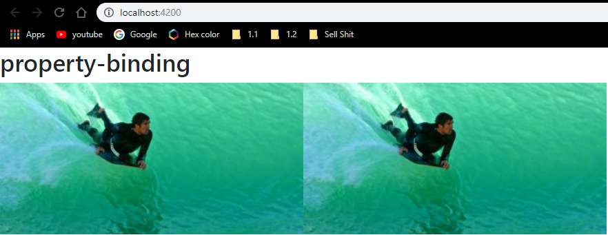

###Praktikum 2 : Attribute Binding

* Buka file `courses.component.ts` dan tambahkan property colspan di bawah `**imageUrl**`.

* Buka file `courses.component.html` dan tambahkan berikut ini : 

```html
<table>
    <tr>
        <td [colspan] = 'colspan'></td>
    </tr>
</table>
```

* Buka browser lalu inspect makan akan keluar error.
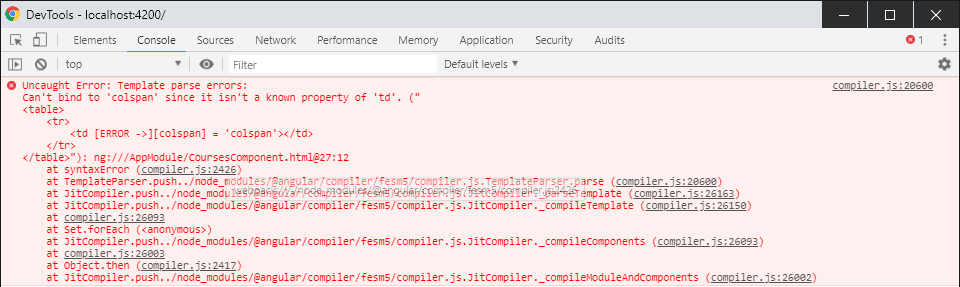
menyatakan bahwa binding colspan dan colspan bukan property td.

* Tambahkan `attr` pada colspan.
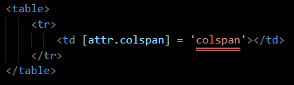

* Compile
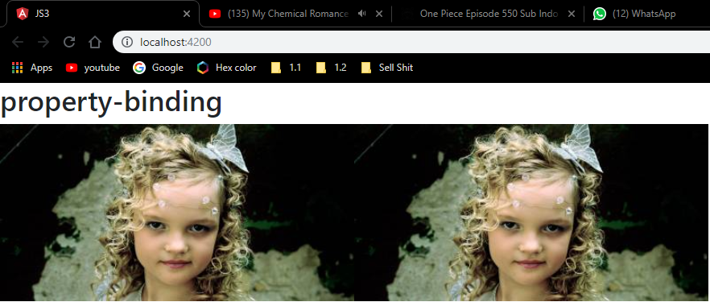

* Selanjutnya tambahkan button pada `courses.component.html`.


###Praktikum 3 : Class binding.

* Buka file `courses.component.ts` dan tambahkan property `isActive` setelah line colspan

* Buka file `courses.component.html` lalu tambahkan class binding.
![]

* Rubah isActive menjadi false dan inspect element maka kondisi active akan hilang.
![]


###Praktikum 4 : Style Binding

* Buka file `courses.component.html` kemudian tambahkan code berikut.
```html
<button type="button" class="btn btn-primary" [style.backgroundColor]="isActive?'blue':'white'">Style</button>

```
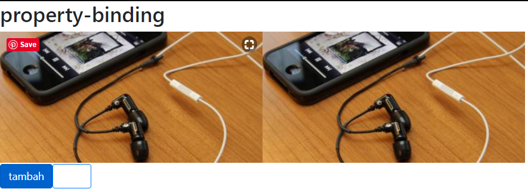

###Praktikum 5 :Event Binding
* Buka file `courses.component.ts` dan buatlah method dengan nama onSave.
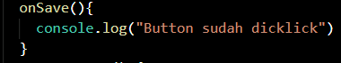

* Buka file `courses.component.html` dan tambahkan event click.
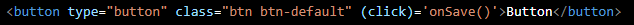

* Jalankan localhost dan lakukan inspect element. Jika button di click maka di console akan keluar `"button sudah di click"`.


* Buka file `course.component.ts` tambahkan parameter `$event`.
```html
isActive = false;
onSave($event){
    console.log("button sudah di click",$event)
}

* Tambahkan juga pada `courses.component.html`
```html
<button type="button" class="btn btn-primary" [style.backgroundColor]="isActive?'blue':'white'">Style</button>

<button type="button" class="btn btn-danger" (cick)="onSave($event)">Button</button>
```

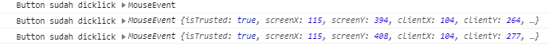

* Buatlah method divClick pada `courses.component.ts`.
```html
onDivclick($event){
    console.log("ini method div",$event)
}
```

* Tambahkan div dan event binding pada div elemen.
```html
<div (click)="onDivClick($event)">
    <button type="button" class="btn btn-danger" (cick)="onSave($event)">Button</button>
</div>

```

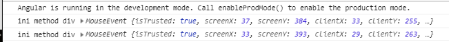

* Untuk mengatasi event bubbling maka tambahkan `$event.stopPropagation` pada `courses.component.ts`

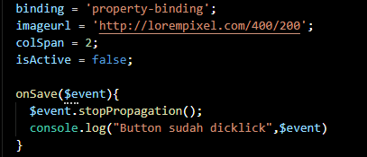


###Praktikum 6 : Event Filtering

* Buat inputan pada `courses.component.html`
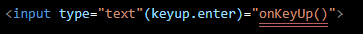

* Tambahkan method onKeyUp
```html
onKeyUp(){
    console.log("enter was pressed");
}
```

* Jalankan lalu isikan sesuatu pada kolom inputan yang sudah di buat dan lakukan inspect. Perhatikan pada console.


* Bandingkan dengan button enter ditekan.


###Praktikum 7 : Template Variable

* Tambahkan variable #nama pada `courses.component.html`.
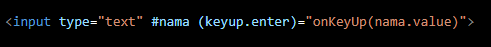

* Tambahkan parameter nama pada method `onKeyup`.
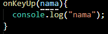

* Cek dengan inspect element
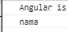


###Praktikum 8 : Two Way Binding

* Buat property baru dengan nama kalian dan rubah parameter pada log.
```html
nama = 'daffa'
```

* Tambahkan parameter nama pada method onKeyUp

* Perhatikan apa yang terjadi pada kolom inputan. Cek pada inspect element.


* Buka `app.module.ts` dan tambahkan formmodule seperti berikut.
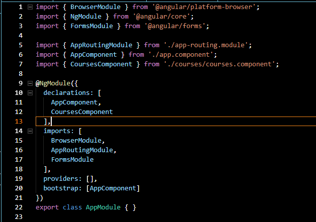

* Buka `course.component.html`, modifikasi code nya seperti berikut :
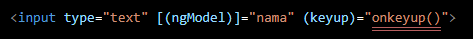

* Cek pada inspect element apa yang terjadi.
